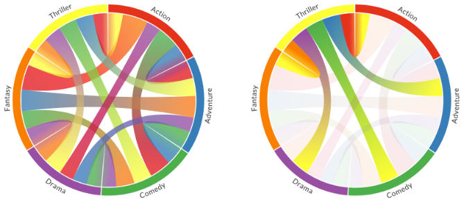
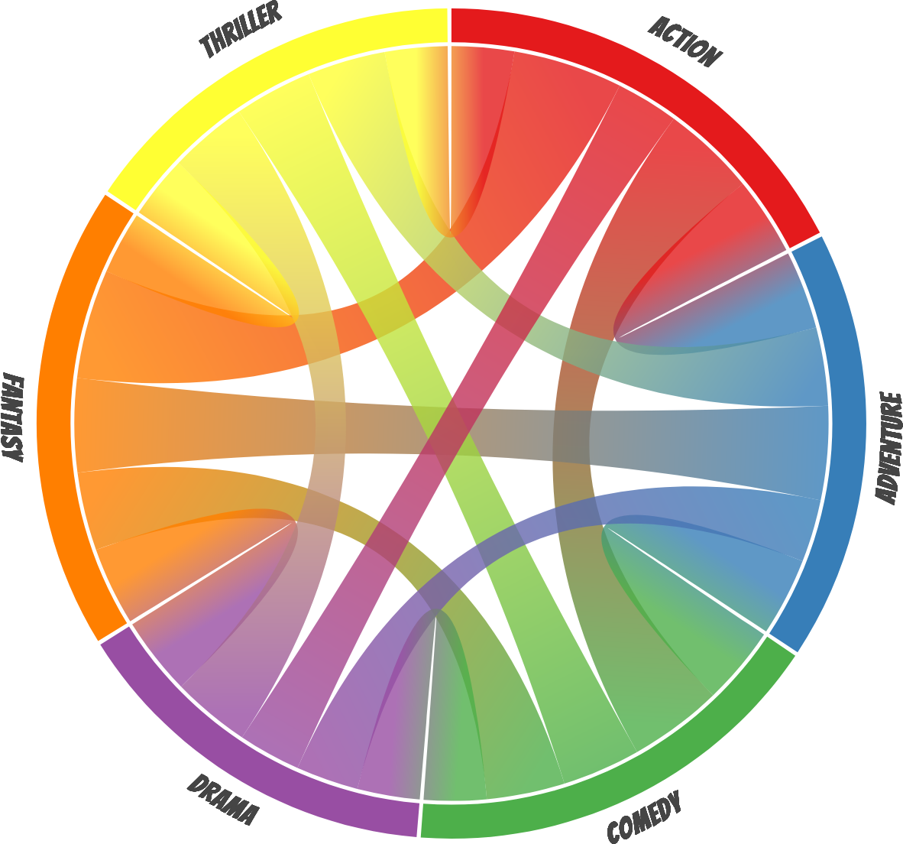
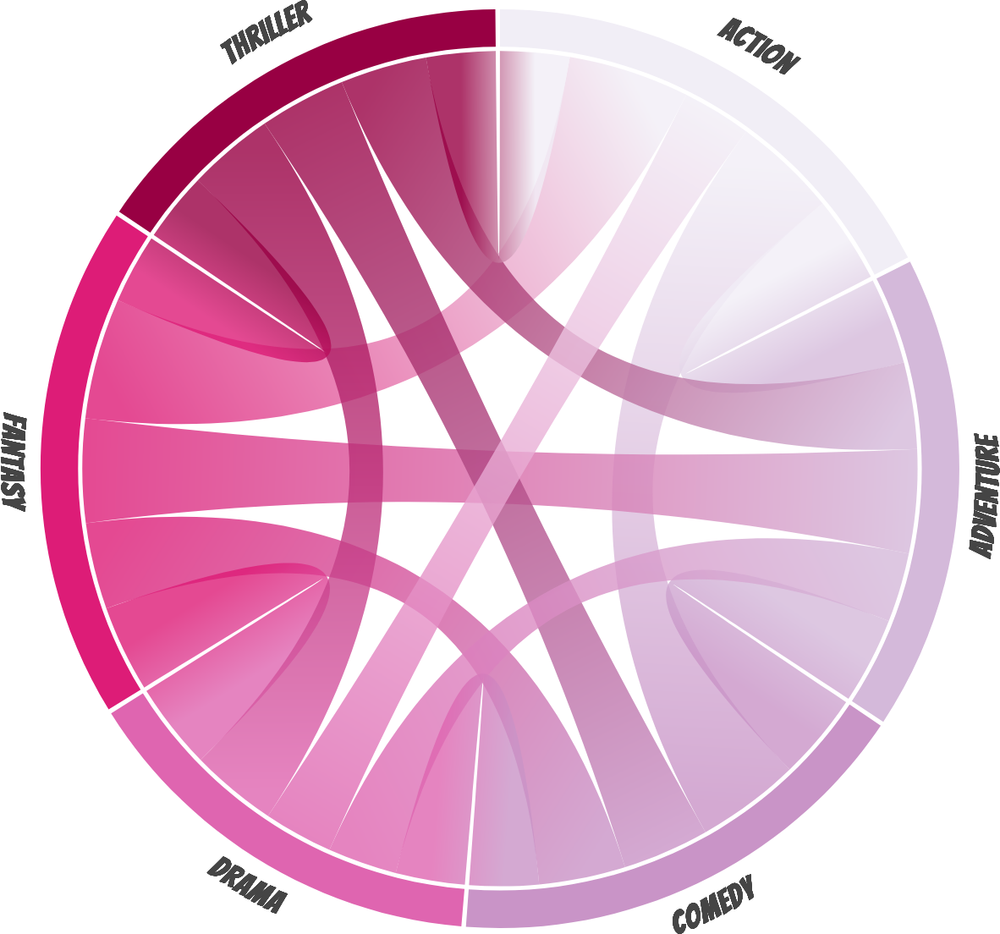

# Chord PRO Released

[Chord PRO](https://m8.fyi/chord) is the full-featured chord visualization API, producing beautiful interactive visualizations, e.g. those featured on the front page of Reddit.

- Produce beautiful interactive Chord diagrams.
- Customize colours and font-sizes.
- Access Divided mode, enabling two sides to your diagram.
- Add images and text on hover,
- Access finer-customisations including HTML injection.
- Allows commercial use without open source requirement.
- Currently supports Python, JavaScript, and Rust, with many more to come (accepting requests).

[Get it here!](https://m8.fyi/chord)


# Changelog:

- **23 December 2020** - [`Chord PRO`](https://store.shahinrostami.com/product/chord-pro/) now supports `reverse_gradients`.



- **02 December 2020** - [`Chord PRO`](https://store.shahinrostami.com/product/chord-pro/) now has [better support] for text customisation with the `conjunction` parameter.

- **21 November 2020** - [`Chord PRO`](https://store.shahinrostami.com/product/chord-pro/) now has [better support](https://twitter.com/ShahinRostami/status/1330145866758434818) for asymmetric chord diagrams.

- **03 November 2020** - [`Chord PRO`](https://store.shahinrostami.com/product/chord-pro/) now supports nodes with no relationships.

- **26 October 2020** - [`Chord PRO`](https://store.shahinrostami.com/product/chord-pro/) now supports Downloading to image when multiple Chord diagrams appear on the same page.

- **03 October 2020** - [`Chord PRO`](https://store.shahinrostami.com/product/chord-pro/) now supports visualising [occurrences as well as co-occurrences](https://github.com/shahinrostami/chord/issues/18#issuecomment-703174362).

- **29 August 2020** - [`Chord PRO`](https://store.shahinrostami.com/product/chord-pro/) now supports enabling a Download to image button.

- **16 August 2020** - [`Chord PRO`](https://store.shahinrostami.com/product/chord-pro/) now supports radius scaling and bipartite titles.

- **13 August 2020** - [`Chord PRO`](https://store.shahinrostami.com/product/chord-pro/) now supports Arc numbers.

- **23 July 2020** - [`Chord PRO`](https://store.shahinrostami.com/product/chord-pro/) now supports figure titles.

- **20 July 2020** - [`Chord PRO`](https://store.shahinrostami.com/product/chord-pro/) now supports asymmetric mode using `symmetric=False`! You can also override the `verb` used in the popup.

- **14 July 2020** - [`Chord PRO`](https://store.shahinrostami.com/product/chord-pro/) can now be enabled by entering your [license key](https://store.shahinrostami.com/product/chord-pro/).


- **29 June 2020** - Optimisation and bug fixes to the tooltip have massively improved the interactive performance of the visualisation (**Rebuild your chord diagrams** to take advantage of this change).

- **22 May 2020** - Optimisation and bug fixes have massively improved the interactive performance of the visualisation (**Rebuild your chord diagrams** to take advantage of this change).

- **21 May 2020** - Please update to the latest version of `chord`. Backwards compatibility has been introduced, so from this version onwards, new versions won't break older ones!


# Introduction

In a chord diagram (or radial network), entities are arranged radially as segments with their relationships visualised by arcs that connect them. The size of the segments illustrates the numerical proportions, whilst the size of the arc illustrates the significance of the relationships<sup id="fnref-footnote"><a class="footnote-ref" href="#fn-footnote">1</a></sup>.

Chord diagrams are useful when trying to convey relationships between different entities, and they can be beautiful and eye-catching.

## The Chord Crate

I wasn't able to find any Rust crates for plotting chord diagrams, so I ported [my own](https://pypi.org/project/chord/) from Python to Rust.


You can get the package either from [crates.io](https://crates.io/crates/chord) or from the [GitHub repository](https://github.com/shahinrostami/chord_rs). With your processed data, you should be able to plot something beautiful with just a single line, `Chord{ matrix : matrix, names : names, .. Chord::default() }.show()`

The primary support is for `Jupyter Lab` (not the older `Jupyter Notebook`).

# Installation

Available on [crates.io](https://crates.io/crates/chord).

```bash
:dep chord = {Version = "0.2.1"}
use chord::{Chord, Plot};
```

# Examples

You can see the actual interactive examples [on this page](https://shahinrostami.com/posts/programming/rust-notebooks/chord-diagrams/). The below examples are screenshots.

## The Dataset

The focus for this section will be the demonstration of the `chord` package. To keep it simple, we will use synthetic data that illustrates the co-occurrences between movie genres within the same movie.

```rust
let matrix: Vec<Vec<f64>> = vec![
    vec![0., 5., 6., 4., 7., 4.],
    vec![5., 0., 5., 4., 6., 5.],
    vec![6., 5., 0., 4., 5., 5.],
    vec![4., 4., 4., 0., 5., 5.],
    vec![7., 6., 5., 5., 0., 4.],
    vec![4., 5., 5., 5., 4., 0.],
];

let names: Vec<String> = vec![
    "Action",
    "Adventure",
    "Comedy",
    "Drama",
    "Fantasy",
    "Thriller",
]
.into_iter()
.map(String::from)
.collect();
```

## Default Settings

Let's see what the `Chord` defaults produce when we invoke the `show()` method.

```rust
Chord {
    matrix: matrix.clone(),
    names: names.clone(),
    ..Chord::default()
}
.show();
```



You can also save it to a HTML file.

```rust
Chord {
    matrix: matrix.clone(),
    names: names.clone(),
    ..Chord::default()
}
.to_html();
```

## Different Colours

The defaults are nice, but what if we want different colours? You can pass in almost anything from [d3-scale-chromatic](https://github.com/d3/d3-scale-chromatic#categorical), or you could pass in a list of hexadecimal colour codes.

```rust
Chord {
    matrix: matrix.clone(),
    names: names.clone(),
    colors: "d3.schemeSet2".to_string(),
    ..Chord::default()
}
.show();
```


```rust
Chord {
    matrix: matrix.clone(),
    names: names.clone(),
    colors: format!("d3.schemeGnBu[{:?}]",names.len()).to_string(),
    ..Chord::default()
}
.show();
```


```rust
Chord {
    matrix: matrix.clone(),
    names: names.clone(),
    colors: "d3.schemeSet3".to_string(),
    ..Chord::default()
}
.show();
```


```rust
Chord {
    matrix: matrix.clone(),
    names: names.clone(),
    colors: format!("d3.schemePuRd[{:?}]",names.len()).to_string(),
    ..Chord::default()
}
.show();
```



```python
Chord {
    matrix: matrix.clone(),
    names: names.clone(),
    colors: format!("d3.schemeYlGnBu[{:?}]",names.len()).to_string(),
    ..Chord::default()
}
.show();
```


```rust
let hex_colours : Vec<String> = vec!["#222222", "#333333", "#4c4c4c", "#666666", "#848484", "#9a9a9a"].into_iter()
.map(String::from)
.collect();

Chord {
    matrix: matrix.clone(),
    names: names.clone(),
    colors: format!("{:?}",hex_colours),
    ..Chord::default()
}
.show();
```


## Label Styling

We can disable the wrapped labels, and even change the colour.

```rust
Chord {
    matrix: matrix.clone(),
    names: names.clone(),
    wrap_labels: false,
    label_color:"#4c40bf".to_string(),
    ..Chord::default()
}
.show();
```


## Opacity

We can also change the default opacity of the relationships.

```rust
Chord {
    matrix: matrix.clone(),
    names: names.clone(),
    opacity: 0.1,
    ..Chord::default()
}
.show();
```


# Diagram Size

We can change the maximum diagram size by specifying a width.

```rust
Chord {
    matrix: matrix.clone(),
    names: names.clone(),
    width: 400.0,
    ..Chord::default()
}
.show()
```


<div class="footnote">
<hr>
<ol>
<li id="fn-footnote">
<p>Tintarev, N., Rostami, S., & Smyth, B. (2018, April). Knowing the unknown: visualising consumption blind-spots in recommender systems. In Proceedings of the 33rd Annual ACM Symposium on Applied Computing (pp. 1396-1399).&nbsp;<a class="footnote-backref" href="#fnref-footnote" title="Jump back to footnote 1 in the text">↩</a></p>
</li>
</ol>
</div>


# Data and Templates

## Chord FREE package

The `chord` package switches to `FREE` mode when a username and license are not specified, or if they are both set to `"free"`. This disables the use of all the `PRO` features.

This uses the Chord FREE API service hosted on the `DataCrayon.com` (AWS hosted) server to generate your visualisation.

Chord FREE uses the [AGPL-3.0 License](https://github.com/shahinrostami/chord/blob/master/LICENSE).

## Chord PRO (full-featured) package

The `chord` package switches to `PRO` mode when a username and license are specified. This enables the use of all the `PRO` features.

This uses the Chord PRO API service hosted on the `DataCrayon.com` (AWS hosted) server to generate your visualisation.

